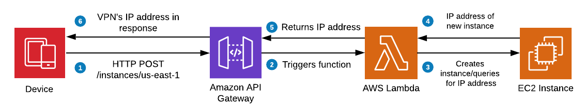

# Tutorial: VPN on Demand with Siri, Shortcuts, Python, AWS EC2 & Lambda

Sometimes you need a VPN for a short period of time (like when you'll be on public Wi-Fi for a little while). [Amazon EC2](https://aws.amazon.com/ec2/) makes deploying servers to be used as VPNs for this purpose pretty simple and cost-effective since you're only charged from the time you start until the instance's termination. Open-source projects like [hwdsl2/setup-ipsec-vpn](https://github.com/hwdsl2/setup-ipsec-vpn) make this even easier. However, this requires you to get onto the AWS Console to get everything set up, which can sometimes be a pain. The motivation for this project was to be able to do this on the go:


(It works on iOS 13 too 😊)

To make this work, we're going to be deploying some Python code as a Lambda function on AWS. This code will start/stop/list EC2 instances for us based on an EC2 template we'll create. This template will run the [setup-ipsec-vpn](https://github.com/hwdsl2/setup-ipsec-vpn) script on new instances automatically. We'll use [AWS API Gateway](https://aws.amazon.com/api-gateway/) to create a RESTful API that will trigger the Lambda function. Finally, we'll use Apple's [Shortcuts](https://apps.apple.com/us/app/shortcuts/id915249334) app to make an HTTP request to the API endpoint we create. Visually, this is what's going on:



(Icons used above can be found at [AWS](https://aws.amazon.com/architecture/icons/))

## What you need:

* An [Amazon AWS account](https://aws.amazon.com). If this is your first time signing up, you'll be eligible for the [free tier](https://aws.amazon.com/free/?all-free-tier.sort-by=item.additionalFields.SortRank&all-free-tier.sort-order=asc). 
* A computer with [Python 3](https://python.org) and the [AWS CLI](https://aws.amazon.com/cli/) installed and [configured](https://docs.aws.amazon.com/cli/latest/userguide/cli-configure-quickstart.html)
* An iOS device with the [Shortcuts](https://apps.apple.com/us/app/shortcuts/id915249334) app installed

## Limitations/Disclaimer

* You'll be limited to deploying only in one AWS region at a time, since EC2 Launch Templates are tied to a region. In this tutorial, we use `us-east-1` as our region.

* **About AWS charges:** Some of the services used in this post are intended to fall within the free tier usage, however some do not. Lambda offers 1 million Lambda requests every month even once your free-tier access expires, while API Gateway only offers 1 million requests per month for the first year, and EC2 offers 750 hours per month on t2.micro instances (what we're using) for the first year. Make sure to review pricing for [Lambda](https://aws.amazon.com/lambda/pricing/), [API Gateway](https://aws.amazon.com/api-gateway/pricing/) and [EC2](https://aws.amazon.com/ec2/pricing/on-demand/) before continuing. Also, as we test things out in this tutorial, keep an eye on your AWS console to make sure anything you created to test with gets deleted to avoid incurring extra charges.

* This is more of a demo so far than anything else! I'd love any feedback on how to make it more secure or user-friendly in the future.

Let's get started!

## Creating the EC2 Launch Template

EC2 Launch Templates are a great way to save a frequently used EC2 launch configuration (i.e. instance type, security groups, firewall rules, storage, etc.). In our case our launch template will have all the necessary configuration necessary to deploy an EC2 instance as a VPN for us.

1. Sign into your [AWS Console](https://console.aws.amazon.com) and ensure you're in the region you want to deploy your VPNs to (you can see this at the top right of the screen). In this guide we use `us-east-1` (North Virginia). Head over to Services > EC2.

2. First, we'll set up a **Security Group**, which contains the firewall rules for our EC2 instance. On the left side of the page, click on "Security Groups" under "Network and Security. Click "Create Security Group".

3. Give your group a name, leave the VPC dropdown at its default, and set the following *inbound* UDP rules (leave Outbound at its default): this will allow you to connect to your server.


(Note: For greater security, you can restrict `Source` further here: perhaps to a range of IP addresses)

4. Save the security group. Next we'll create a key pair, useful if you want to SSH into your instance in the future. Under "Network & Security", click on "Key Pairs".

5. Click "Create Key Pair" and follow the instructions (if you already have set up one, you can use that key pair instead for the remainder of this guide)

6. Now we'll create our launch template. Under "Instances", click on "Launch Templates", and then "Create launch template". Give the template a name, and begin filling out the form. For the AMI, I chose one that corresponded to Ubuntu 18.04 (you can check what OS's are currently being supported by [hwdsl2/setup-ipsec-vpn](https://github.com/hwdsl2/setup-ipsec-vpn#requirements)). I filled out the following details:

```
Instance Type: t2.micro (Free Tier eligible)
Key pair: The key pair you created in step (5)
Security groups: The security group you created in step (3)
Storage (volumes): If a volume wasn't added automatically once you picked the AMI, click "Add new volume". Make sure "Delete on termination" is set to Yes, and leave everything else at default.
```

7. Under "Resource tags", click "Add tag" and set a key of `instance_type` to `vpn`. Leave "Resource types" at its default (should have "Instances" selected). This will cause EC2 instances deployed with this template to be tagged, which lets us keep them separate from other instances and makes sure our Lambda function terminates the right instance when asked to.

8. Under "Advanced details", scroll to "User data". This is where we'll put the script from [hwdsl2/setup-ipsec-vpn](https://github.com/hwdsl2/setup-ipsec-vpn#installation) in. Make sure to put `#!/bin/bash` at the top of the script since this is being executed in a Bash shell. It's executed when your instance is booted for the first time. To find out more about User Data, check the [Amazon docs](https://docs.aws.amazon.com/AWSEC2/latest/UserGuide/user-data.html#user-data-shell-scripts) on it.

	

	Fill out `VPN_IPSEC_PSK`, `VPN_USER` and `VPN_PASSWORD` with an IPSec PSK (should be >20 random characters), a VPN username and password. Generate these and store them in a password manager. Every time an instance is created, these credentials will be used and only the IP address will change.

    > _Note_: More secure than using user data here may be to have this shell script in a secured S3 bucket accessed at launch time or pass the user data at launch time with Lambda, pulling credentials from Lambda environment variables.

9. Save the launch template and note the name you gave to it. Also note the launch template ID. If you'd like to test and see if it works, you can [launch an EC2 instance based on it](https://docs.aws.amazon.com/AWSEC2/latest/UserGuide/ec2-launch-templates.html)! Follow the connection instructions [here](https://github.com/hwdsl2/setup-ipsec-vpn/blob/master/docs/clients.md) after it's been up and running for a few minutes (it can take a little bit as the script is installing/updating packages)

Otherwise, let's move on to the Lambda part of the project!

## Setting up our Lambda function

[Amazon Lambda](https://aws.amazon.com/lambda/) is a service that allows you to write code and execute it using various triggers (here we use an HTTP request). What's so neat about it is you're only charged for the time and resources your code uses while it runs, saving quite a bit. Here, we're using some Python code to automatically launch an EC2 instance based on the template we defined above (or terminate/list instances).

I've already written the code and you can check it out on [GitHub here](https://github.com/mm/siri-shortcuts-vpn). It uses the [Flask](https://flask.palletsprojects.com/en/1.1.x/) framework to define a tiny API that can receive HTTP requests and act on them accordingly. We'll package this up and deploy it as a Lambda function with the popular [Zappa](https://github.com/Miserlou/Zappa) package a little later. Before that, we need to ensure our function will have the right permissions and make sure it works locally!

### Creating the necessary IAM policy

For Lambda to be able to perform EC2 actions on your behalf (starting servers up, shutting them down...) it needs permissions to do so. When using AWS, we define these permissions by an [IAM policy](https://docs.aws.amazon.com/IAM/latest/UserGuide/access_policies.html). We'll set one up here:

1. Log in to your AWS Console > Services > IAM. Select "Policies" from the sidebar, and then "Create policy". Switch from the visual editor to JSON mode and replace the policy in the text editor with the following:

	```json
	{
		"Version": "2012-10-17",
		"Statement": [
			{
				"Sid": "VisualEditor0",
				"Effect": "Allow",
				"Action": "ec2:Describe*",
				"Resource": "*"
			},
			{
				"Effect": "Allow",
				"Action": [
					"ec2:RunInstances",
					"ec2:CreateTags"
				],
				"Resource": "*",
				"Condition": {
					"ArnLike": {
						"ec2:LaunchTemplate": "arn:aws:ec2:AWS_REGION:ACCOUNT_ID:launch-template/LAUNCH_TEMPLATE_ID"
					}
				}
			},
			{
				"Sid": "VisualEditor2",
				"Effect": "Allow",
				"Action": "ec2:CreateTags",
				"Resource": "arn:aws:ec2:*:ACCOUNT_ID:instance/*",
				"Condition": {
					"StringEquals": {
						"ec2:CreateAction": "RunInstances"
					}
				}
			},
			{
				"Sid": "VisualEditor3",
				"Effect": "Allow",
				"Action": [
					"ec2:TerminateInstances",
					"ec2:StartInstances",
					"ec2:StopInstances"
				],
				"Resource": "*",
				"Condition": {
					"StringEquals": {
						"ec2:ResourceTag/instance_type": "vpn"
					}
				}
			}
		]
	}
	```

Fill in the `AWS_REGION`, `ACCOUNT_ID` and `LAUNCH_TEMPLATE_ID` with the AWS region you made your EC2 launch template in (for example, I used `us-east-1`), your AWS account ID (numeric) and your launch template ID from the last section.

This policy allows your function to describe details about any EC2 instance, create new instances when your launch template was specified, create tags on an instance during its creation, and only start/stop/terminate instances tagged as VPNs. For more examples of policies if you're interested (as they relate to EC2 instances), [Amazon's docs](https://docs.aws.amazon.com/AWSEC2/latest/UserGuide/ExamplePolicies_EC2.html#iam-example-runinstances) have a wealth of info. With this policy, any parameters in your launch template *can* be overridden at launch time (ideally you'd want to lock this down further).

2. Click "Review policy" and give your policy a name. Then click "Create policy" to save the policy.

### Creating a test IAM user with the IAM policy

This step allows us to test out the code locally before deploying. Here we'll create an IAM *user* and attach our *policy* to it. 

1. Log in to your AWS Console > Services > IAM. Select "Users" from the sidebar, and click "Add user".

2. Give the user a username (doesn't matter) and make sure **Programmatic access** is checked.

3. Click Next, and click "Attach existing policies directly". Search for your policy, ensure it's checked and click Next again. You can leave tags blank. Finally, click Create user. Make note of the *Access key ID* and *Secret access key* -- we will be using these shortly.

### Working with the code locally

With all of the policy setup out of the way, we're ready to go! Now, we'll deploy a web service I wrote using Flask to Lambda. First, we'll test the code locally, and once it's working, we'll use [Zappa](https://github.com/Miserlou/Zappa) to automate deployment. These instructions are also on my [GitHub repo](https://github.com/mm/siri-shortcuts-vpn) for this project.

1. Ensure you've installed the [AWS CLI](https://aws.amazon.com/cli/), [configured your environment](https://docs.aws.amazon.com/cli/latest/userguide/cli-configure-quickstart.html) and have Python 3 and pip ready to go for local development. 

2. Clone this repository in a directory of your choosing: `git clone git@github.com:mm/siri-shortcuts-vpn.git`

3. I recommend setting up a [virtual environment](https://packaging.python.org/guides/installing-using-pip-and-virtual-environments/) for this project to keep its dependencies/versions of those dependencies separate from other projects. 

4. Once in the project folder, with your virtual environment activated, install the packages this code relies on: `pip install -r requirements.txt`

5. Create an `.env` file in the root folder of the project and fill in the following environment variables. This will allow you to simulate using the IAM policy you created in tutorial to ensure it works before deploying.

	```
	AWS_ACCESS_KEY_ID=access_key_id_you_just_created
	AWS_SECRET_ACCESS_KEY=secret_access_key_you_just_created
	AWS_DEFAULT_REGION=fill_in_your_aws_region_here_(e.g us-east-1)
	LAUNCH_TEMPLATE_NAME=fill_in_your_launch_template_name_here
	```

6. If everything is in order, you should be able to run `python3 app.py` in the root directory to start up the Flask development server. Look out for the command's output. By default, the server will be listening for connections on port 5000.

7. Try making HTTP requests to your server! You can use cURL, [httpie](https://httpie.org), [Paw](https://paw.cloud), [Postman](https://www.postman.com) or any API testing tool you'd like. For example, if I was trying to deploy instances in the US-East-1 region (and that's where my launch template was stored), with cURL I'd make this request to try starting up:

	```console
	$ curl -X POST http://localhost:5000/instances/us-east-1
	```

	If successful I should get a response like this:

	```
	{"instance_id":"i-some-instance-id","ip":"<some ip address>","region":"us-east-1"}
	```

Getting running instances can be done via a GET request (i.e. ```curl -X GET http://localhost:5000/instances/us-east-1```) and terminating instances in a region can be done via a DELETE request (```curl -X DELETE http://localhost:5000/instances/us-east-1```). The code attempts to make sure only 1 instance is running at a time (to protect against accidentally starting many instances at once) -- so DELETE works as intended (deletes the whole collection of instances, but that collection is only supposed to contain 1 instance at a time).

Once you're sure everything is working okay, let's deploy to Lambda!

## Deploying to Lambda and API Gateway

For deployment, we could totally wrap up our Flask app ourselves and set up API Gateway to send requests to it. However, this would take a little time and is a bit beyond the scope of this tutorial. [Zappa](https://github.com/Miserlou/Zappa) is an open-source Python tool I've been using for a while now. It can:

* Wrap your code up (including all dependencies) in a `.zip` package that is automatically uploaded to Lambda
* Create an [AWS API gateway](https://aws.amazon.com/api-gateway/) endpoint (and help you secure it with an API key/another form of authorization). This endpoint is set up as a [Lambda proxy integration](https://docs.aws.amazon.com/apigateway/latest/developerguide/set-up-lambda-proxy-integrations.html), where API Gateway passes all request data (method, headers, etc.) to your Lambda function transparently. This means you can set up routing in your Flask, Django or (insert framework here) app and not have to fiddle too much with routing in API Gateway. 

... among other things! I highly recommend checking out the docs for Zappa, it's an extremely useful tool for serverless apps like this.

1. While in the project directory from before (and in your virtual environment), run `zappa init` in your terminal. You should get something like this:


2. Go through the setup steps and keep the default options as you go through. Open up your `zappa_settings.json` file. Mine looks like this:

	```json
	{
		"dev": {
			"app_function": "app.app",
			"aws_region": "us-east-1",
			"profile_name": "default",
			"project_name": "siri-shortcuts-",
			"runtime": "python3.8",
			"s3_bucket": "zappa-9bh21r44r"
		}
	}
	```

3. First, ensure your `aws_region` value matches the AWS region your EC2 template is located in. If not, change that (I've been using `us-east-1` throughout this tutorial). Next, we're going to add two keys: `api_key_required` (to secure our API with an API key) and another key `aws_environment_variables` to set environment variables in the Lambda environment (currently we only need one for our launch template name):

	```json
	{
		"dev": {
			"app_function": "app.app",
			"aws_region": "us-east-1",
			"profile_name": "default",
			"project_name": "siri-shortcuts-",
			"runtime": "python3.8",
			"s3_bucket": "zappa-9bh21r44r",
			"api_key_required": true,
			"aws_environment_variables": {
				"LAUNCH_TEMPLATE_NAME": "Your launch template name here (not ID)"
			}
		}
	}
	```

4. Save `zappa_settings.json`. We should be good to go! Assuming you named your stage `dev` (as in Zappa setup), you can run `zappa deploy dev` in your terminal! (Side note: Zappa supports deploying multiple stages! i.e. You could have totally different environment variables/security settings for the dev vs. prod vs. staging vs. whatever stage you want. Very cool!) This could take a few minutes while dependencies are packaged and uploaded. There should be a bunch of output. At the end, you should see something like this:

	```console
	Deploying API Gateway..
	Created a new x-api-key: zgjcmuieo1
	Deployment complete!: https://bsy9qfjo7k.execute-api.us-east-1.amazonaws.com/dev
	```

5. That URL in the Zappa output is actually part of our endpoint URL! We'll be making requests to it soon. As you can see from the last step, an API Key was created for our project, but it hasn't been associated with our endpoint yet. Let's secure that now. Sign into your AWS Console > API Gateway. You should see your project listed as an API! If not, ensure your region is set to the one you used in `zappa_settings.json`. Click on it, and then click on Usage Plans.

6. Create a new usage plan (it can be named whatever you want), and enable throttling. I keep mine restrictive since I'm the only one supposed to be using it anyway: at 1 request per second and 1000 per month. Hit "Next."

7. Add your API there! Click "Add API Stage" and then choose your API from the list, as well as the `dev` stage. Click the grey checkmark and hit "Next". Click "Add API Key to Usage Plan". 

8. For the "Name", search `dev_` plus the beginning of your endpoint URL. For example, Zappa outputted `https://bsy9qfjo7k.execute-api.us-east-1.amazonaws.com/dev` in step 4, so I chose `dev_bsy9qfjo7k`:


9. Hit the grey checkmark, click "Done" and you're good to go! You should see a list of Usage Plans on your account. Click the one you just created then "API Keys". Click the API key you added, and then click "Show" where it says **API key**. Make note of this key as it's the key you'll use to make requests!

10. Head to Services > Lambda in your console. Again, you should see the Zappa-created Lambda function there. Click on it, then click on "Permissions". You should see an execution role listed there. Click on it. This is the role your Lambda function uses, and to add extra permissions to it (the ability to launch and shut down EC2 instances), we'll attach the policy we created earlier.

11. Click on the "Attach policies" button, and search for the IAM policy you created a few sections back. Select it, and click "Attach policy". That's all!

After all this work, it's finally time to test it! Here I'm using cURL, but you can use whatever API testing tool you want:

```console
$ curl -H "x-api-key: api_key_here" -X GET https://bsy9qfjo7k.execute-api.us-east-1.amazonaws.com/dev/instances/us-east-1

{"region":"us-east-1","running_instances":[]}
```

If we want to start up an instance, we POST to the endpoint instead. We can see we get back the server's IP in the response (we can use this to connect!)

```console
$ curl -H "x-api-key: api_key_here" -X POST https://bsy9qfjo7k.execute-api.us-east-1.amazonaws.com/dev/instances/us-east-1

{"instance_id":"i-09912cc4f30e020d7","ip":"54.236.255.219","region":"us-east-1"}
```

Note that if you try and run this when a VPN is already running, the function will return a 429 - Too Many Requests response instead. This is to prevent accidentally starting too many instances up and incurring additional charges.

To connect to your instance, wait a few minutes and then follow [this guide](https://github.com/hwdsl2/setup-ipsec-vpn/blob/master/docs/clients.md). Use the IP address your function outputs, as well as the key, username and password you set way back when you made the EC2 launch template! You should have an up and running VPN.

If we want to delete the instance, we can send a DELETE request and get some info about how many instances we terminated and where (or, we could go to our EC2 dashboard manually as always)

```console
$ curl -H "x-api-key: api_key_here" -X DELETE https://bsy9qfjo7k.execute-api.us-east-1.amazonaws.com/dev/instances/us-east-1

{"instances_terminated":1,"region":"us-east-1"}
```

If ever you want to remove everything (delete the endpoint, Lambda function and so on), you can run `zappa undeploy dev` from the project directory (or just remove from the AWS Console directly).

## Making use of our API with Shortcuts and Siri

Since we've created a web service, technically anything capable of making an HTTP request (and passing headers for our API key) should be able to trigger our function. For this guide, we'll use [Shortcuts](https://apps.apple.com/us/app/shortcuts/id915249334), an iOS app by Apple. Of the many actions Shortcuts has, "Get Contents of URL" is the primary workhorse we'll be using as it can make arbitrary HTTP requests and output the results. I've made 3 shortcuts for you to use and look through how they work. Click on them to install the shortcut on your iOS device (it'll ask a few questions on import like what your endpoint URL and API key are) and review what they do before running them. You might have to change your device's settings to allow untrusted shortcuts to run.

* [Start EC2 VPN](https://www.icloud.com/shortcuts/1b8b413d86a344aabde5930c5efc05f3): This will make a POST request to your endpoint to start a new server up. If successful, it will copy the server's IP to your clipboard.
* [List running VPNs](https://www.icloud.com/shortcuts/a59e74bd60fc4af49a2d71738756bbd5): This will make a GET request to your endpoint, and afterwards return the number of servers running (should at most be 1) and copy the IP address to your clipboard.
* [Terminate EC2 VPN](https://www.icloud.com/shortcuts/eb95f06e7f5e4ecaa292e1639530b233): This will terminate all VPN instances (with a DELETE request) running in a given region, and tell you how many instances were terminated.

To get Siri up and running, simply tell Siri to "Run Shortcut Name", for example "Run Start EC2 VPN" to launch a new VPN. I'd give the server some time before trying to connect to it (in my tests one took close to 5 minutes once). You can follow the instructions at [hwdsl2/setup-ipsec-vpn](https://github.com/hwdsl2/setup-ipsec-vpn/blob/master/docs/clients.md) to get connected!

That's all there is to it! Thanks for checking out this tutorial/demonstration; it's been helpful for me in the past and was fun to try out so I hope it helps you too! This is one of the first technical tutorials I've written publicly, so I'd really appreciate any feedback you have!

Huge thanks to [Lin Song](https://github.com/hwdsl2) for writing the setup-ipsec-vpn setup script our template uses and documentation for connecting! 😊